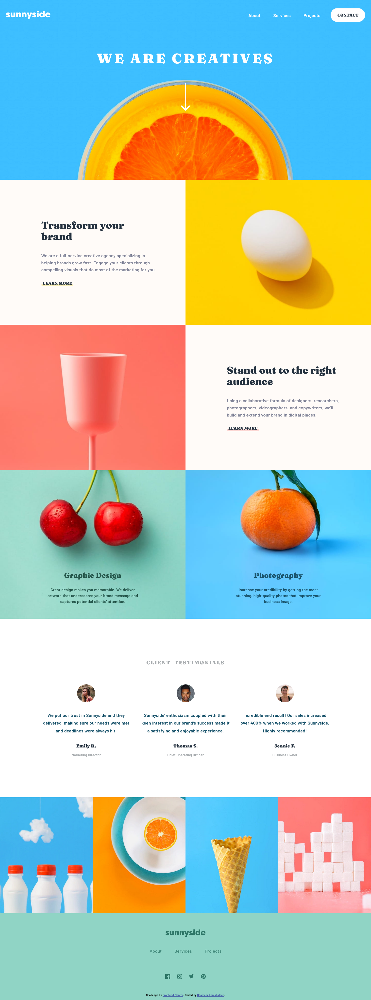

# Frontend Mentor - Sunnyside agency landing page solution

This is a solution to the [Sunnyside agency landing page challenge on Frontend Mentor](https://www.frontendmentor.io/challenges/sunnyside-agency-landing-page-7yVs3B6ef). Frontend Mentor challenges help you improve your coding skills by building realistic projects.

## Table of contents

- [Overview](#overview)
  - [The challenge](#the-challenge)
  - [Screenshot](#screenshot)
  - [Links](#links)
- [My process](#my-process)
  - [Built with](#built-with)
  - [What I learned](#what-i-learned)
  - [Continued development](#continued-development)
- [Author](#author)

## Overview

This is the first time creating a full-page challenge from the frontend mentor and only a couple of such were done before and seems like more such challenges require in order to learn to organize the designs methods and coding. Setting up a pre-made raw template may help to reduce the time taken to complete a page or entire website. Need a lot of experience to come up with such a template which may be able to reuse without much or not all editing required on any new page or design starts, it seems better to make one along with the practice.

### The challenge

Users should be able to:

- View the optimal layout for the site depending on their device's screen size
- See hover states for all interactive elements on the page

### Screenshot

### Links

- Solution URL: [Click here](https://github.com/shameerkamaludeen/sunnyside-agency-landing-page)
- Live Site URL: [Click here](https://shameerkamaludeen.github.io/sunnyside-agency-landing-page/)

## My process

### Built with

- Semantic HTML5 markup
- Flexbox
- CSS Grid
- Mobile-first workflow

### What I learned

Its been a very few full-page designs completed so far in the learning journey and this challenge really helped thinking to generate a pre-made or default style template for such a design in the long run as the time taken to complete the challenge seems a lot. Organising style rules and HTML to find different sections to add declarations later will help reduce the time to complete the task.   

### Continued development

From this challenge learned a number of things to improve like organizing the code and design rules, achieving the same result with the reduced code and repetition and time needed to complete the task. Along with that improve accessibility.

## Author

- Github - [Shameer Kamaludeen](https://github.com/shameerkamaludeen)
- Frontend Mentor - [@shameerkamaludeen](https://www.frontendmentor.io/profile/shameerkamaludeen)